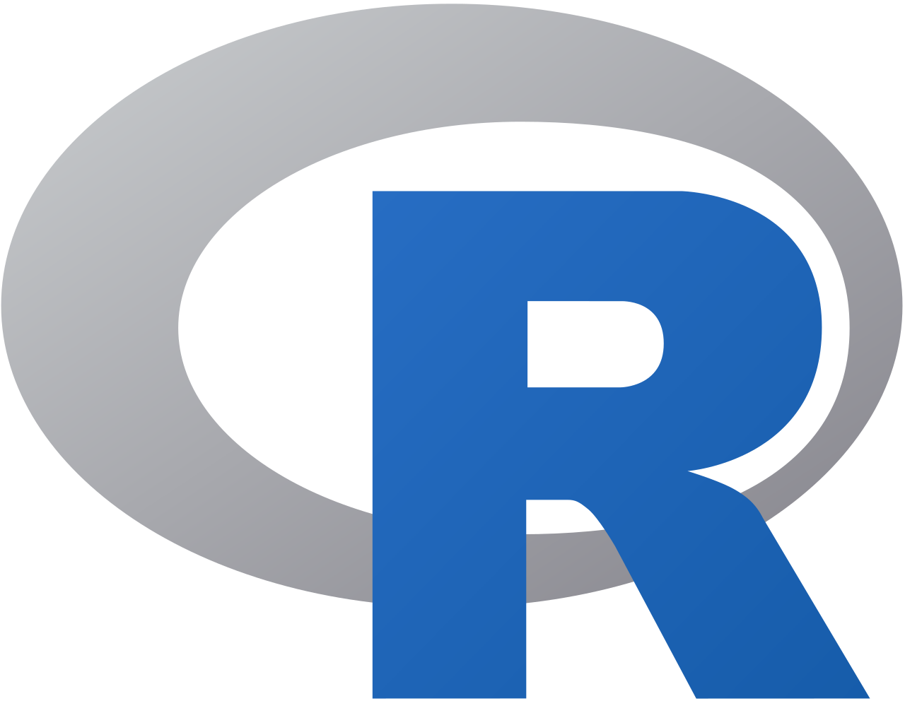
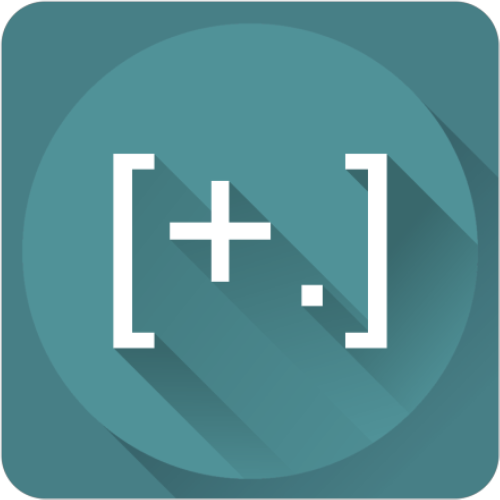
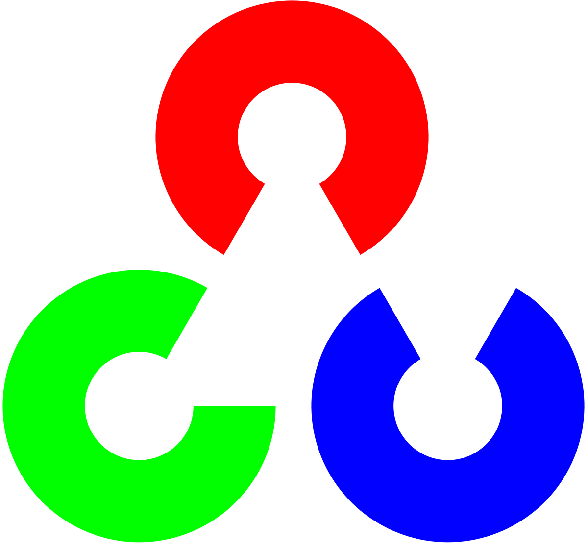
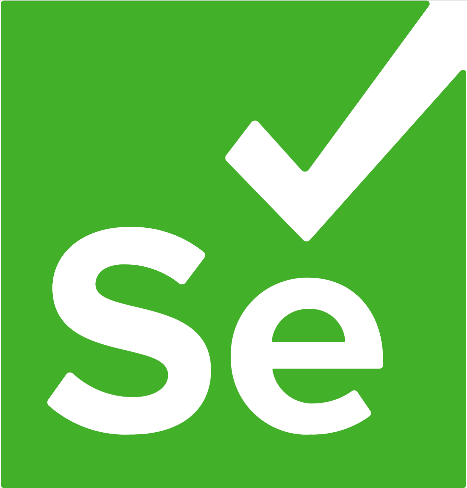

# Welcome to my github profile!

## Nice to meet you!

I'm Ryan, and I am a full-time computer science student who does content creation on the side.

---

## Who am I?

-    **Pronouns**: He/They
-    **Linguality**: Fluent in English and Mandarin, with a little bit of Malay
-    **Education**: 2nd year Diploma in Computer Science student
-    **Currently working on**: Open source tools for co-working streamers and YouTube videos about it
-    **Currently learning**: Frontend web frameworks, particularly Svelte and Vue
-    **Website**: Check out my website [here](https://liyunze-coding.github.io)

---

## Languages

 

## Others

---

## Ambitions

-    Fullstack Web Developer
-    Computer Vision Engineer
-    Voice actor
-    Content Director
